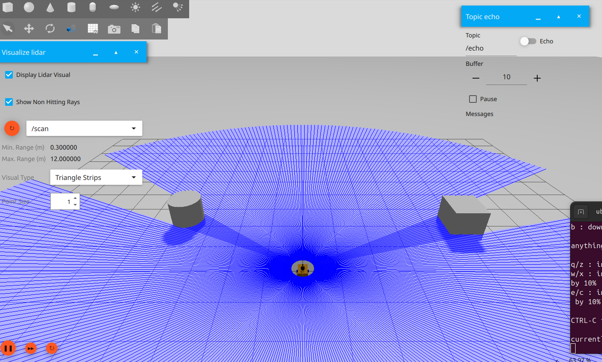
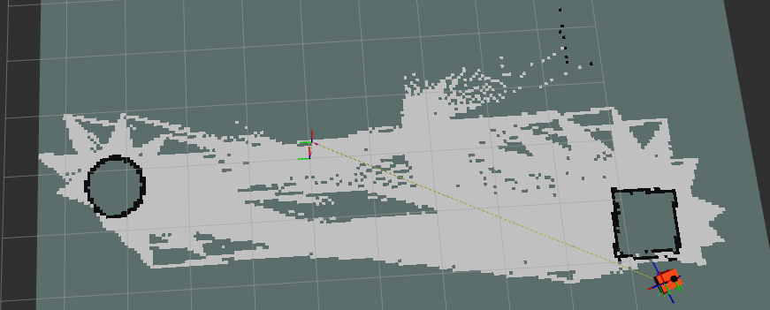
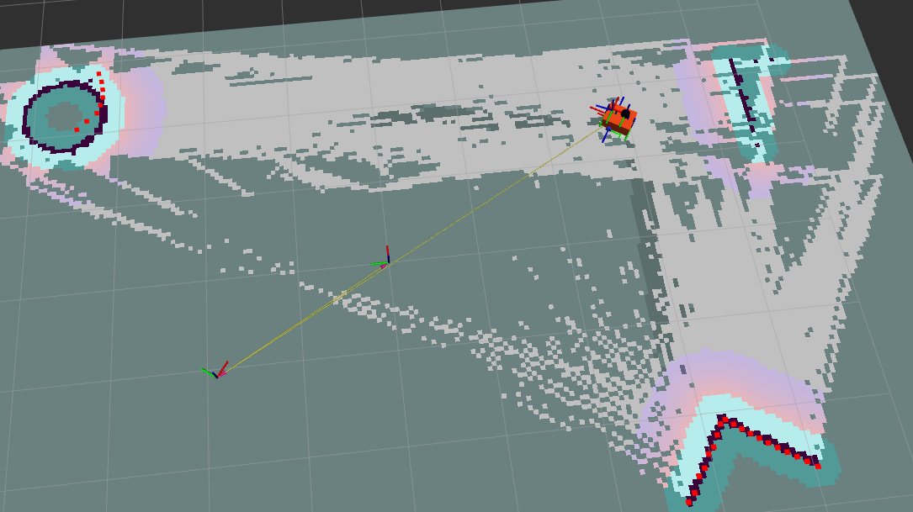

# Ackerman

## Build and launch

```bash
$ cd ackerman/ackerman_robot
$ colcon build
$ . install/setup.bash
$  ros2 launch ackerman_robot ackermann_drive_example.launch.py 
```


<div id="ros_control">

## Ros control

First, the current ackermann project was based on the [ros_control_demo](https://github.com/ros-controls/gz_ros2_control/tree/rolling/gz_ros2_control_demos/examples). They already have an ackermann example that can be tested with the example_ackermann_drive.cpp.

After that, the teleop key node can be added to the launch file with the valid remap from <code>/cmd_vel</code> to <code>controller_name>/reference</code>.

In order to move the ackerman robot, the [steering_controllers_library](https://control.ros.org/rolling/doc/ros2_controllers/steering_controllers_library/doc/userdoc.html#steering-controllers-library-userdoc) was used. It already handles the ackermann project where the wheels on one axis are fixed (traction/drive) wheels, and the wheels on the other axis are steerable.

## Overall working

### The urdf file

Each link has its joint, nothing remarkable.

At the end of the file we can see the ros2_control parameters. It uses the <code>gz_ros2_control/GazeboSimSystem</code> plugin. Every joints specified inside the <ros_control> tag will be send to <code>robot_description</code> topic where 
ros_control listens.

First we can notice that the two back (or rear) wheels have a <code>command_interface</code> and <code>state_interface</code> for velocity, and only a <code>state_interface</code> for the position.

On the contrary the two front wheels have <code>command_interface</code> and <code>state_interface</code> for position and nothing for velocity.

So, these two interface are from the [Hardware interfaces](http://docs.ros.org/en/melodic/api/hardware_interface/html/c++/index.html)) and to quote the website:"Hardware interfaces are used by ROS control in conjunction with one of the available ROS controllers to **send** (hardware_interface::RobotHW::write) **commands** to the hardware and **receive** (hardware_interface::RobotHW::read) **states** from the robot's resources (joints, sensors, actuators)."

We can summarize by saying ros_control send <i>data</i> to the joint in the command tag et take <i>data</i> from the state tags.

In our case, it is just interesting to note that we <i>send</i> and <i>receive</i> <i>data</i> from velocity from our rear wheels (so the ones used for traction). And we <i>send</i> and <i>receive</i> <i>data</i> from position from our front wheels in charge of steering.

For more information about commands and interfaces, go take a look at [this section](#ros_control)


The file ends with the gazebo plugin, which look for the <code>config/ackermann_drive_controller.yaml</code> file. This file is used as bridge between ros2 (what we write in the .urdf) and gazebo.


### The ros2 yaml paramters

The <code>.yaml</code> in the <code>/config</code> directory as mentioned above, allowed an easier way to write parameters for a node. Here we write all the parameters of <code>controller_manager</code> and <code>ackermann_steering_controller</code> into the <code>.yaml</code> file which will be loaded in the urdf file.

It is in this file that we declare and initialize all necessary parameters for the <code>ackerman_steering_controller</code>. For more information about parameters, go take a look at [this section](#ros_control)

We can note that for the <code>ackermann_steering_controller</code> (from the  steering_controllers_library), we give it which wheel are the rear ones and which are the front ones.


### The launch file 

```bash
teleop_keyboard = Node(
    package="teleop_twist_keyboard",
    executable="teleop_twist_keyboard",
    prefix="xterm -e",
    parameters=[{'stamped': True}],
    remappings=[('cmd_vel','/ackermann_steering_controller/reference')]
)
```
This part launchs an xterm terminal where we can we can control the robot with our keyboards thanks to the teleop_twist_keyboard, that listen to the keys pressed and sends a <code>geometry_msgs/msg/TwistStamped</code> message to the <code>/cmd_vel/</code> forum.

The <code>cmd_vel</code> is remapped to the <code>ackermann_steering_controller/reference</code>. The first one is the command from the letters we type in the xterm terminal. The second one is the one that make the robot actually move. I will, once again, redirect you to [this section](#ros_control) for more information about **why** <code>ackermann_steering_controller/reference</code>.
 

## Ros control

So for ros_control documentation, first the official documentation:

The github repository where you can find demos (including ackermann demo) : [ros_control_demo](https://github.com/ros-controls/gz_ros2_control/tree/rolling/gz_ros2_control_demos/examples)

The documentation for the [steering_controllers_library](https://control.ros.org/rolling/doc/ros2_controllers/steering_controllers_library/doc/userdoc.html#steering-controllers-library-userdoc), linked with the ros_control_demo and very useful.

This parts ends with [this](https://fjp.at/posts/ros/ros-control/) not official website explaining rather well ros_control and its inner working for beginners. 


## NAV2

In order to properly use NAV2, we have a few things to add / modify first

### Lidar

In order to navigate autonomously, we need to be able to see around us. So the first thing to do was to add a lidar. 
We add it link in joint in the URDF file, to the form of our choice.  Then, we need to add its connection to the gazebo sensor.

```
<gazebo reference="laser_frame">
        <material>Gazebo/Red</material>

        <sensor name="laser" type="gpu_lidar">
            <pose> 0 0 0 0 0 0 </pose>
            <visualize>false</visualize>
            <update_rate>10</update_rate>
            <lidar>
                <scan>
                    <horizontal>
                        <samples>360</samples>
                        <min_angle>-3.14</min_angle>
                        <max_angle>3.14</max_angle>
                    </horizontal>
                </scan>
                <range>
                    <min>0.3</min>
                    <max>12</max>
                </range>
            </lidar>
           <topic>scan</topic>
            <gz_frame_id>laser_frame</gz_frame_id>
        </sensor>
    </gazebo>
```

There is a few things to note about this component. 
First we can see that its type is a `gpu\_lidar`
The frame name is `laser_frame`, which is the link to that will act as the lidar.
The topic `scan` tells to which topic we are going to publish our received data.
`update_rate` is the frequency at which the lidar data is generated.

Under the `horizontal` tag we define the properties of the horizontal laser rays.
`samples` is the number of simulated lidar rays to generate per complete laser sweep cycle.
The `min_angle` and `max_angle` are the angle range of the generated rays.

Under the `range` we define range properties of each simulated ray
`min` and `max` define the minimum and maximum distance for each lidar ray.
The `resolution` tag here defines the linear resolution of each lidar ray.


From there, in gazebo, we can add the plugin `Vizualize lidar`, subcribe it to the `/scan` topic and we should be able to see the radar.




You can take a look at this [link](https://gazebosim.org/docs/latest/sensors/) to know more about sensors in gazebo.


### SLAM

In order to update as wished slam, we copied the file from the `slam_toolbox/config/` directory. 
These lines are the ones must interesting to us.

```
scan_topic: /scan
mode: localization

map_file_name: /home/ubuntu/Documents/ackerman/ackerman_robot/my_map_serial2
```

We can see we could update the scan_topic to the one describe in the URDF sensor component.
The map_file_name precise a path to wich an already made map we can load.


Here is the command to run slam on top of the launch 'launch/ackermann_sim.launch.py':

`
ros2 launch slam toolbox online_async.launch.py params_file:=/config/slam.yaml use_sim_time:=true
`

And here is the result.




[Here](https://docs.nav2.org/tutorials/docs/navigation2_with_slam.htm) is the official documentation.


### NAV2 (really this time)

Nav uses the map created by SLAM for estimating the robot position.
On top of this static map, is added the live data provided by lidar to be sure not to bump into anything. This new map is called a costmap. 

We can now run the nav2 node. The only real difficulty is some remapings. Indeed we need to make sure that nav2 send its cmd to our `ackermann_robot/reference' topic. Still an weird unknown issue today. But it works fine for a diffbot robot. One issue was that diffbot does not use TimeStamp messages unlike the ackermann_steering_controller. And there was an issue as nav may publish unstamped message. However, this issue is suppose to fix from quite some years now.

You can launch nav2 node with the following command :

`
ros2 launch nav2_bringup  navigation.launch.py use_sim_time:=true
`




Furthermore, in rvizz, you can see a goal green array, that you can point to a point within you map. If everything is okay, your robot will start to move towards where the green array aims.


# Documentation

## Ros

I put here some sources that have really helped me (including the documentation of course).

The following link is a great way to get back to the ros fundamentals.
https://docs.ros.org/en/foxy/Tutorials.html

This youtube chain explains extremely well ros2 concept. Here it is about transforms.
https://www.youtube.com/watch?v=QyvHhY4Y_Y8

And this documentation is really great to start gazebo,
https://gazebosim.org/docs/latest/moving_robot/
