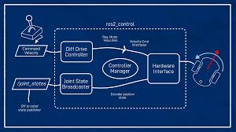

# I - PI - side

For this part you are encourage to first read the <code>Readme-simulation</code> file, as this one is based on the simulation.

## 1 - How to run

In order to run this program you need to have a servo motor pluged in the 3 or 4 digital pin of an arduino, a brushless moteur pluged in the 8 or 9 digital pin and a arduino connected to a PI by a USB cable on <code>/dev/ttyACM0</code>

Then, on the PI, you can run the following command:
```
$ colcon build
$ source install/setup.bash
$ ros2 launch ackermann_robot ackermann_hardware.launch.py
```

A <code>teleop_twist_keyboard</code> should open where you can type letter and see your motors move.

## 2 - Launch file

The hardware launch file is pretty similar the simulation one. 


From the <code>simulation</code> we have added <code>rvizz</code> and this part:

```
joint_state_broadcaster_spawner = Node(
    package="controller_manager",
    executable="spawner",
    arguments=["joint_state_broadcaster", "--controller-manager", "/controller_manager"],
)


robot_controller_spawner = Node(
    package='controller_manager',
    executable='spawner',
    arguments=[controller,
                '--param-file',
                robot_controllers,
                '--controller-ros-args',
                '-r /'+controller+'/tf_odometry:=/tf',
                ],
)
```

The first node: <code> joint_state_broadcaster_spawner</code>:

TODO

The second  node: <code>robot_controller_spawner</code>:

TODO


## 3 - Hardware interface

### 3.1 - How everything works 

We will be using the following schema from, <strong>articulatedRobot</strong> to explain everything.



For the <strong>Command Velocity</strong> we are using <code>teleop_twist_keyboard</code>. Each time we click on a key, it will send a <code>Twist</code> message to the <code>cmd_vel</code> topic.

For the <strong>Diff Drive Controller</strong> we are using a </strong>Ackerman_steering_controller</strong> because we have an ackermann robot and not a differential robot. 
This controller will retrive the <code>Twist</code> message, calculate velocities and positions for each wheel and "send" it to our hardware interface.

In the <strong>Hardware interface</strong>, more precisely in the <code>write</code> fonction, we are retrievig the updated values for our wheel. From there we call the <code>send</code> method from the <code>ArduinoComms</code> class (<code>hardware/include/ackermann_robot/arduino_comms.hpp</code>). This method will send a message to the arduino in order for the robot to update its velocity/position.

### 3.2 -  Controller used

As said, here we are using the [ackerman_steering_controller]("https://control.ros.org/rolling/doc/ros2_controllers/steering_controllers_library/doc/userdoc.html#steering-controllers-library-userdoc"). You can find in the `config/ackermann_controller.yaml`file the `ros_parameter` of the controller. 


### 3.3 - In the URDF file

First in order to use our hardware interface we need to export it in the `ackerman_robot.xml' file. We can then use it in our urdf file.

```
<ros2_control name="OnyCroit" type="system">
      <hardware>
        <plugin>ackerman_robot/DiffDriveArduinoHardware</plugin>
        <param name="front_left_wheel_name">left_wheel_steering_joint</param>
        <param name="front_right_wheel_name">right_wheel_steering_joint</param>
        <param name="rear_left_wheel_name">rear_left_wheel_joint</param>
        <param name="rear_right_wheel_name">rear_right_wheel_joint</param>
        <param name="loop_rate">30</param>
        <param name="device">/dev/ttyACM0</param>
        <param name="baud_rate">115200</param>
        <param name="timeout_ms">1000</param>
        <param name="enc_counts_per_rev">3436</param>
        <param name="pid_p">20</param>
        <param name="pid_d">12</param>
        <param name="pid_i">0</param>
        <param name="pid_o">50</param>
      </hardware>
```

This part was added to the urdf file. First we put the plugin,`ackerman_ronbot/DiffDriveArduinoHardware' (TODO change  name), in our hardware, . Then we put all of its asked parameters, and as for gazebo we put the joints below.

### 3.4 - hardware/diffbot_system.cpp

`diffbot_system.cpp` is the file containing the code of the hardware interface. You can find [here](https://control.ros.org/rolling/doc/ros2_control/hardware_interface/doc/writing_new_hardware_component.html) the requirements for creating an hardware interface.  


`on_init`: The first function called. Checked that the joints declared in the `ros_control` component contains the right `command_interface` and `state_interface`. 

`export_state_interfaces`: returns a list of `StateInterface` allowing the plugin to link the wheel in order to calculate the velocity and position.

`export_command_interfaces`: same that the previous function but for the command interfaces.

`write`: This method will read the updated velocities and position from the component we have given the plugin in the export methods. It is called approximately 9 times per second by the TODO.
From there we have multiple options:
- First we only take 1 message on 5. Otherwise the Arduino can't handle that much command and a queue will beginning to form, delaying the response time.
- We send servos message only if the rear wheels are moving. Otherwise if you click once on the left, it will continue to send you messages to turn. We have taken into account the `j` and `l` keys.

It the conditions are met. We then send the message.

### Send message

A class, `hardware/ackermann_robot/arduino_commes.hpp` was created to send messages from the hardware interface to the arduino. It will message under the following format:

```
<CMD NUMBER>
```

And wait with a timeout of 1 second for the response of the arduino.

# II - Arduino side 

The code for the arduino side can be found in the <code>hardware</code> directory.

## 1 - Communication with PI

As said before,the PI and arduino communicates by Serial communication, with an USB cable. The chosen baudrate (bit par second) is <strong>115200</strong>. I put the maximum in order to communicate as fast as possible (not sure though).

The arduino receive the PI message by the <code>read</code> function. I first used the function <code>readString</code> function but as said in its <a href= "https://docs.arduino.cc/language-reference/en/functions/communication/serial/readString/">documentation</a>. 

```
The function terminates if it times out .
The function does not terminate early if the data contains end of line characters.
```
Thus, the <code>readString</code> function was not optimum to make the communication between the PI and arduino faster

The <code>read</code> function will read character by character. Thus, in the loop loop, we recontruct the message character by character. A message is under this format: 

``` 
<CMD NUMBER>
```

With <code>CMD</code> being a letter:
- u : update servos
- b: update brushless motors

and <code>NUMBER</code> meaning:
- If <code>CMD</code>==u then a negative/positive number would mean turning left/right
- If <code>CMD</code>==b then the number indicate the speed fron 1500. (explained later)


After recreating the message, we set the different hardware and end with the execution of everything.


### 2 - Servos

The servo motor code can be found the the <code>servos.h</code> and <code>servos.ino</code> files in the <code>SweepServo</code> class.

We will receive a command each time the user will click on the keyboard. 

We will received messages such as 

```
<u 1>
<u -1>
```

- A negative number means we are going to the left to our current position. 
- A positive number means we are going to the right to our current position. 


### 3 - Brushless

The brushless motor code can be found the the <code>motors.h</code> and <code>motors.ino</code> files in the <code>Motor</code> class.

We will receive a command multiple time by second, to simulate a slow down if the user stop typing on the keyboard.


To move the brushless motor we are using the <code>writeMicroseconds</code> method.  
- The neutral position is at <strong>1500</strong>. 
- Moving forward is between <strong>1600</strong> to <strong>2000</strong>
- Moving backward is between <strong>1000</strong> to <strong>1400</strong>

Below 1000 microseconds or more than 2000 microseconds may damage the motor.

We will received messages such as 

```
<b 300>
<b -300>
```

We will take the neutral position <strong>1500</strong> and add to it the number fron the command, leading to:

```
<b 300> => 1800
<b -300> => 1200
```

We cannot excede 2000 or 1000 microsecond. This number will be what we will send to our motor.
