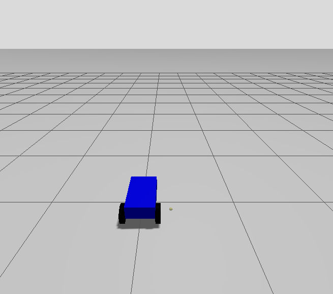
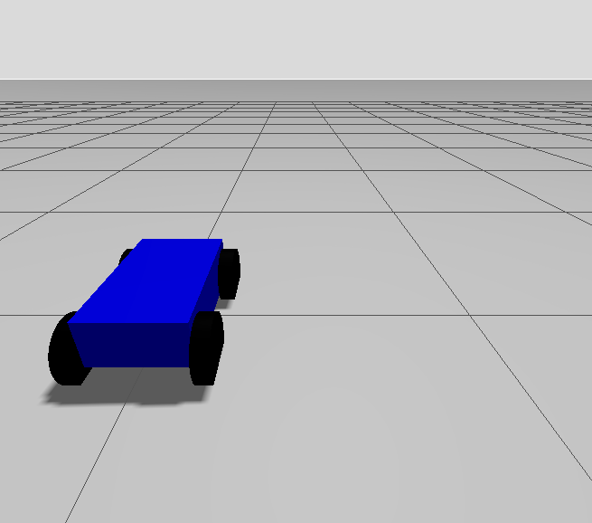

# Diff robot

This package containes a lot of different sub-projects that lead to the creation of the final one....

## The src directory

### The .sdf file
For the story: as I was having issues making everything things works, I first created everything in an .sdf file.

```bash
$ cd ackerman/diff_drive
$ colcon build
$ . install/setup.bash
$ gz sim src/simple_robot_model.sdf 
```
### src/vehicule.urdf and src/vehicle.xacro

Both are the same, the urdf file is juste the calculate version of the vehicle.xacro file. I was using them trying to divide the robot from the sdf.


## The model directory

In this directory, you can find all robots that works.

The two_wheels.xacro file contains the robot with 2 wheels and a caster wheel.




The four_wheels.xacro fine contains the cousin of the two_wheels robot. It contains 4 wheels. To solve the issue of the two first ones stopping the movement, I put their friction at 0.



#### Run

Put the wanted file in the display.launch.py then

```bash
$ cd ackerman/diff_drive
$ colcon build
$ . install/setup.bash
$  ros2 launch diff_drive vehicule.launch.py 
```

To make the robot move add the KeyPublisher plugin the the top right corner. For more information go to the my_robot_description package.

# Documentation

## Ros

I put here some sources that have really helped me (including the documentation of course).

The following link is a great way to get back to the ros fundamentals.
https://docs.ros.org/en/foxy/Tutorials.html

This youtube chain explains extremely well ros2 concept. Here it is about transforms.
https://www.youtube.com/watch?v=QyvHhY4Y_Y8

And this documentation is really great to start gazebo,
https://gazebosim.org/docs/latest/moving_robot/
