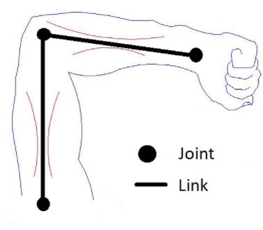
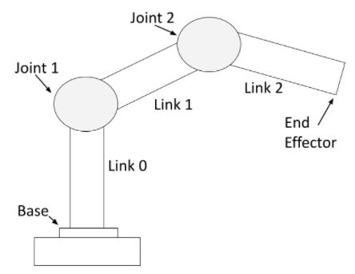
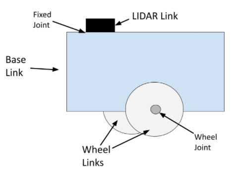
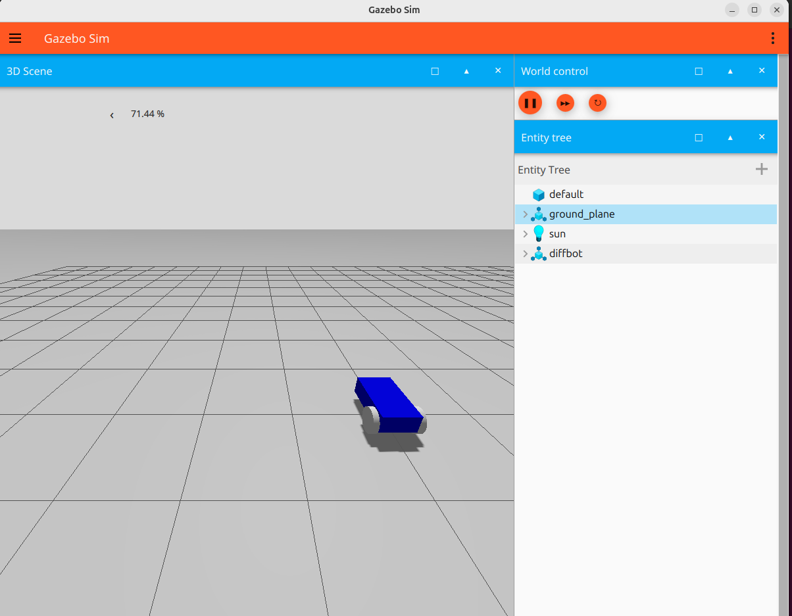
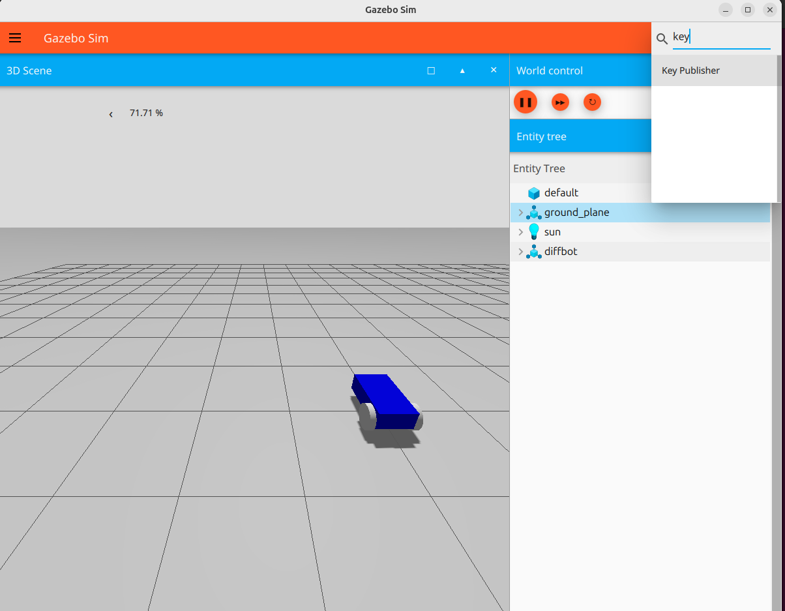

<span style="color:red">

## Warning
Il est <u>**fortement**</u> recommandé d'être sur un os ubuntu, ou machine virtuelle ubuntu (version 24 de préférence), pour ce skill_book et pour votre projet. Même si vous avez réussi à bidouiller votre chemin jusqu'ici, il existe de nombreux conflits pour télécharger gazebo et les prochaines bibliothèques dont vous aurez besoin. Vous risquez juste de perdre beaucoup de temps à les installer.

</span>

Voici le lien(https://youtu.be/DhVjgI57Ino) d'une vidéo youtube pour installer une machine virtuelle ubuntu 24.0.

Et la documentation(https://docs.ros.org/en/jazzy/Installation/Ubuntu-Install-Debs.html) officielle pour installer ros2.

# I - Modélisation du robot


## 1 - Description et contexte

Dans cette partie, nous allons voir la création d'un robot en urdf.
Une fichier URDF (Universal Robot Description Format) est un document xml qui décrit ce dont à quoi le robot devrait ressembler. Il contient une description complète de la physionomie du robot. 

Un robot est constitué de deux éléments : des Links et des Joints.


Les Links sont les pièces rigides du robots. On pourrait les comparer à des os.

Les Links sont connectées entre elles par des Joints. Les Joints sont les pièces du robot qui peuvent bouger, permettant du mouvement entre les Links. On pourrait comparer les Joints à des articulations.

Considérons le bras humain ci-dessous. L'épaule, le coude, et le poignet sont des joints. Le haut du bras, l'avant-bras et la paume de la main sont des links. 



Pour un bras robotique, les links et joints ressemble à ceci:




On peut voir que le bras robotique est fait de pièces rigides (les links) et des pièces non-rigides (les joints). Les servo-moteurs sont les joints qui permettent au links du bras de bouger.

Et donc pour finir sur un exemple se rapprochant de ce que nous avons fait:




Les roues sont constituées en deux parties: 
- la partie link, la partie visible des roues
- les joints continues, qui tournent autour d’un axe de rotation dans
un mouvement continu sur 360° entraînant avec elles la partie link. Les joints des roues sur la photo connectent les roues link à la base link.


Les joints fixes n'ont pas de mouvements, on peut voir sur la photo que le lidar est connecté à la base du robot par un joint fixe (le joint ici pourrait être une simple vis qui connecterait le LIDAR à la base)


## 2 - Description d’un robot en URDF

### 2.1 -  Warning

Si vous copiez-collez le urdf depuis le skill book directement, les caratères comme '*' et '-' sont mauvais et vous devez les réécrire.

### 2.2 - Proposition mise à jour du code

Regardez le skill book pour avoir étape par étape la création du <code>.urdf</code>. Cependant vous êtes invités à reprendre cette version pour la suite. Il n'y a pas une grande différence, juste quelques valeurs ont changés.

```bash
<?xml version="1.0"?>
<robot name="my_robot" xmlns:xacro="http://ros.org/wiki/xacro">
<!-- Define robot constants -->

   <material name="blue">
        <color rgba="0 0 0.8 1"/>
    </material>

    <material name="black">
        <color rgba="0 0 0 1"/>
    </material>

    <material name="white">
        <color rgba="1 1 1 1"/>
    </material>

    <material name="red">
        <color rgba="1 0 0 1"/>
    </material>

    <material name="green">
        <color rgba="0 1 0 1"/>
    </material>

    <xacro:property name="base_width" value="0.39"/>
    <xacro:property name="base_length" value="0.70"/>
    <xacro:property name="base_height" value="0.20"/>
    <xacro:property name="wheel_radius" value="0.14"/>
    <xacro:property name="wheel_width" value="0.06"/>
    <xacro:property name="wheel_ygap" value="0.035"/>
    <xacro:property name="wheel_zoff" value="0.05"/>
    <xacro:property name="wheel_xoff" value="0.221"/>
    <xacro:property name="caster_xoff" value="0.217"/>

    <!-- Robot base description -->
    <link name="base_link">
        <visual>
            <geometry>
                <box size="${base_length} ${base_width}
                    ${base_height}"/>
            </geometry>
            <material name="Cyan">
                <color rgba="0 1.0 1.0 1.0"/>
            </material>
        </visual>

    </link>

    <xacro:macro name="wheel" params="prefix x_reflect y_reflect">
    <link name="${prefix}_link">
      <visual>
          <origin xyz="0 0 0" rpy="1.5707963267949 0 0"/>
        <geometry>
            <cylinder radius="${wheel_radius}" length="${wheel_width}"/>
        </geometry>
        <material name="White">
          <color rgba="${255/255} ${255/255} ${255/255} 1.0"/>
        </material>
      </visual>
      
    </link>

    <joint name="${prefix}_joint" type="continuous">
        <parent link="base_link"/>
        <child link="${prefix}_link"/>
        <origin xyz="${x_reflect*wheel_xoff} ${y_reflect*(base_width/2+wheel_ygap)} ${-wheel_zoff}" rpy="0 0 0"/>
        <axis xyz="0 1 0"/>
        </joint>
    </xacro:macro>


    <xacro:wheel prefix="drivewhl_l" x_reflect="-1" y_reflect="1" />
    <xacro:wheel prefix="drivewhl_r" x_reflect="-1" y_reflect="-1" />


    <link name="front_caster">
        <visual>
        <geometry>
            <sphere radius="${(wheel_radius+wheel_zoff-(base_height/2))}"/>
        </geometry>
        <material name="White">
            <color rgba="${255/255} ${255/255} ${255/255} 1.0"/>
        </material>
        </visual>
    </link>

    <joint name="caster_joint" type="fixed">
        <parent link="base_link"/>
        <child link="front_caster"/>
        <origin xyz="${caster_xoff} 0.0 ${-(base_height/2)}" rpy="0 0 0"/>
    </joint>

```

# II - Visualisation du robot

# III - Simulation du robot

## 1 -  Les principaux outils de simulation

## 2 - Ajout des paramètres physiques pour la simulation dans l’URDF

## 3 - Gazebo classique

### 3.1 -  Warning

Il y a plusieurs versions de gazebo, ici nous allons utiliser la dernière version de gazebo, que l'on retrouve sous le nom de <code>gazebo gz</code> ou juste de <code>gz</code>.

<span style="color:red"> Méfiez-vous si jamais vous voyez juste <code>gazbo</code>dans un code ou  nom d'une bibliothèque à installer. Il s'agit sûrement d'un ancien code sur la vieille version de gazebo qui n'est plus prise en charge.</span>

Pour plus d'information sur toute l'histoire des versions de gazebo, vous pouvez regarder le schéma de la documentation officielle (https://gazebosim.org/about).

### 3.2 - Installation gazebo

Voici un lien(https://gazebosim.org/docs/latest/ros_installation/) de la documentation officielle pour l'installation de gazebo selon votre distribution.

### 3.3 - Odométrie

Vous êtes invités à lire les explications dans le skill-book, cependant à partir de là nous allons arrêter de suivre le skill book pour le code fourni ou les exercices proposés.

Nous allons tout d'abord rajouter quelques paramètres dans notre urdf:

<code>mu1</code> et <code>mu2</code> sont des coefficients de friction.

```bash
<!-- Gazebo Colors -->
<gazebo reference="base_link">
    <material>Gazebo/Blue</material>
</gazebo>

<gazebo reference="drivewhl_l">
    <material>Gazebo/Black</material>
    <mu1 value="1.0"/>
    <mu2 value="1.0"/>
</gazebo>

<gazebo reference="drivewhl_r">
    <material>Gazebo/Black</material>
    <mu1 value="1.0"/>
    <mu2 value="1.0"/>
</gazebo>

```

Rajoutez le code suivant à la fin de votre robot.


```bash
<gazebo>
        
        <plugin filename="gz-sim-joint-state-publisher-system" name="gz::sim::systems::JointStatePublisher">
            <update_rate>50</update_rate>
            <joint_name>drivewhl_l_joint</joint_name>
            <joint_name>drivewhl_r_joint</joint_name>
        </plugin>
  </gazebo>
```

Ce plugin permet de faire le lien notre robot et gazebo.

### 3.4 - Create the world

Afin de faire une simulation d'un robot dans gazebo, on a besoin de deux choses:
1. Un fichier avec le robot (ce qui a été fait)
2. Un monde où le robot pourra évoluer

Il existe des mondes préfaits, comme *empty-world.sdf* par exemple. Cependant on peut aussi créer le sien afin d'y ajouter des éléments personnalisés (de l'eau si vous voulez tester la flottaison du robot par exemple).

Ainsi nous allons commencer par créer un monde très simple. 

Vous pouvez suivre ce tuto (https://gazebosim.org/docs/latest/sdf_worlds/) pour le créer. Cependat arrêtez vous à l'ajout de la lumière, ne vous embêtez pas avec l'ajout des modèles.

Créez votre monde dans le dossier <code>worlds</code>, sous le nom de <code>world.sdf</code>

### 3.5 - Lancement

Vous pouvez maintenant recopier le code suivant dans votre <code>display.launch.py</code>

```bash
import os
import xacro
from launch import LaunchDescription
from launch_ros.actions import Node
from launch.substitutions import LaunchConfiguration, Command
from launch_ros.substitutions import FindPackageShare
from launch.conditions import UnlessCondition, IfCondition


from ament_index_python.packages import get_package_share_directory
from launch.launch_description_sources import PythonLaunchDescriptionSource
from launch.actions import IncludeLaunchDescription, ExecuteProcess, DeclareLaunchArgument

def generate_launch_description():
    ld = LaunchDescription()
    pkg_share = FindPackageShare(package="my_robot_description").find("my_robot_description")

    xacro_file = os.path.join(pkg_share, 'src/description', 'my_robot_description.urdf')
    robot_desc = xacro.process_file(xacro_file).toxml()

    #default_rviz_config_path = os.path.join(pkg_share, "rviz/urdf_config.rviz")
    
    #gui_arg = DeclareLaunchArgument(
    #        name="gui",
    #        default_value="True",
    #        description="Flag to enable joint_state_publisher_gui"
    #       )
   
    robot_state_publisher = Node(
        package='robot_state_publisher',
        executable='robot_state_publisher',
        name='robot_state_publisher',
        output='screen',
        parameters=[{
            'robot_description': robot_desc,
            'use_sim_time': True
        }]
    )
    
    #model_arg = DeclareLaunchArgument(
    #        name="model",
    #        default_value=default_model_path,
    #        description="Absolute path to robot urdf file"
    #        )
    
    #rvizconfig_arg = DeclareLaunchArgument(
    #        name="rvizconfig",
    #        default_value=default_rviz_config_path,
    #        description="Absolute path to rviz config file"
    #        )
    
    #robot_state_publisher_node = Node(
    #        package="robot_state_publisher",
    #        executable="robot_state_publisher",
    #        parameters=[{"robot_description": Command(["xacro",
    #                                       LaunchConfiguration("srcdescription")])}]
    #        )
    
    joint_state_publisher_node = Node(
            package="joint_state_publisher",
            executable="joint_state_publisher",
            name="joint_state_publisher",
            #condition=UnlessCondition(LaunchConfiguration("gui"))
            )
    #joint_state_publisher_gui_node = Node(
    #        package="joint_state_publisher_gui",
    #       executable="joint_state_publisher_gui",
    #        name="joint_state_publisher_gui",
    #        condition=IfCondition(LaunchConfiguration("gui"))
    #        )
    
    #rviz_node = Node(
    #        package="rviz2",
    #        executable="rviz2",
    #        name="rviz2",
    #        output="screen",
    #        arguments=["-d", LaunchConfiguration("rvizconfig")],
    #        )

    world_file_name = 'world.sdf'
    world_path = os.path.join(pkg_share, 'worlds', world_file_name)
    
    # Gazebo launch
    gazebo = IncludeLaunchDescription(
        PythonLaunchDescriptionSource([os.path.join(
            get_package_share_directory('ros_gz_sim'), 'launch', 'gz_sim.launch.py')]),
        launch_arguments={'gz_args': ['-r ', world_path], 
        'on_exit_shutdown': 'true'}.items()
        # launch_arguments={'world': world_path}.items(),
    )

  

    spawn_entity = Node(
            package='ros_gz_sim',
            executable='create',
            arguments=['-topic','robot_description',
                       '-name', 'diffbot',
                       '-z', '1.0'],
            output='screen'
    )

    #ld.add_action(gui_arg)
    #ld.add_action(model_arg)
    ld.add_action(robot_state_publisher)
    #ld.add_action(rvizconfig_arg)
    ld.add_action(joint_state_publisher_node)
    #ld.add_action(joint_state_publisher_gui_node)
    #ld.add_action(robot_state_publisher_node)
   # ld.add_action(rviz_node)


    # Action needed for gazebo
    ld.add_action(gazebo)
    ld.add_action(spawn_entity)

    return ld


```

Vous pouvez facilement retrouver le fichier de lancement de rvizz. Les commandes inutiles ont été commentés pour que vous voyez quoi enlever.

De plus vous pouvez voir que deux nouveaux noeuds sont arrivés: <code>gazebo</code> et <code>spawn_entity</code>.

Le noeud gazebo est celui qui va lancer gazebo avec notre monde (<code>world.sdf</code>). 
Le deuxième va écouter sur le forum <code>/robot_description</code>, y récupérer les informations sur notre robot et à partir de là les afficher sur gazebo. C'est le <code>robot_state_publisher</code> qui envoie la description de notre robot sur ce forum.

Vous pouvez maintenant tester avec l'habituelle 

```bash
$ ros2 launch my_robot_description display.launch.py
```

Vous devriez voir ceci apparaître:




### 3.6 - Faire bouger le robot 

Maintenant que vous arrivez à faire bouger le robot, faisons-le bouger.

Pour cela, il y a plusieurs plugins à mettre en place:

Le <code>diff_drive</code> plugin:
```xml
<plugin filename="gz-sim-diff-drive-system" name="gz::sim::systems::DiffDrive">
    <odom_publisher_frequency>50</odom_publisher_frequency>
    <left_joint>drivewhl_l_joint</left_joint>
    <right_joint>drivewhl_r_joint</right_joint>
    <wheel_separation>0.4</wheel_separation>
    <wheel_diameter>0.2</wheel_diameter>
    <max_wheel_torque>20</max_wheel_torque>
    <max_linear_acceleration>1.0</max_linear_acceleration>
    <topic>cmd_vel</topic>
    <publish_odom>true</publish_odom>
    <publish_odom_tf>true</publish_odom_tf>
    <publish_wheel_tf>true</publish_wheel_tf>
    <odom_topic>odom</odom_topic>
    <frame_id>odom</frame_id>
    <child_frame_id>base_link</child_frame_id>
</plugin>
```

Celui ci se met dans les tags <code>gazebo</code> dans la description de notre robot.
Pour expliquer les paramètres qu'il prend:
- **filename** est le nom de la library utilisée.
- **name** est le nom du plugin utilsé.
- **left_joint** et **right_joint**  prennent les joints qui seront, respectivement, la roue gauche et droite du robot.
- **odom_publish_frequency** permet de choisir la fréquence à laquelle l'odométrie va être publiée sur le forum <code>\<nom_model\>/odometry</code>
- **cmd_vel** va écouter les instructions envoyés pour faire bouger le robot.


Le second plugin <code>TriggeredPublisher</code>:
```xml
<plugin filename="gz-sim-triggered-publisher-system"
    name="gz::sim::systems::TriggeredPublisher">
    <input type="gz.msgs.Int32" topic="/keyboard/keypress">
    <match field="data">16777235</match>
    </input>
    <output type="gz.msgs.Twist" topic="/cmd_vel">
        linear: {x: 0.5}, angular: {z: 0.0}
    </output>
</plugin>
```

Ce plugin est à mettre dans le fichier world.sdf. Ce plugin accepte les messages de type <code>gz.msgs.Int32</code> depuis le topic <code>/keyboard/keypress</code>.  
Si la valeur reçue match **16777235** (flèche du haut du clavier) alors un message de type <code>Twist</code> est envoyé sur <code>cmd_vel</code> avec comme valeur: **x=0.5** et **Z=0**.

Voici les valeurs des touches et les messages qu'elles doivent renvoyées.

Left ➞ 16777234 ➞ linear: {x: 0.0}, angular: {z: 0.5}  
Up ➞ 16777235 ➞ linear: {x: 0.5}, angular: {z: 0.0}  
Right ➞ 16777236 ➞ linear: {x: 0.0}, angular: {z: -0.5}  
Down ➞ 16777237 ➞ linear: {x: -0.5}, angular: {z: 0.0}  

Créer un plugin pour chacun d'entre elles.  

Relancez Gazebo, dans le coin en haut à droite, dans la liste des plugin possibles, clickez sur <code>KeyPublisher</code>.



Vous pouvez maintenant faire bouger votre robot

### 3.7 - Partir sur ros_control

Maintenant vous avez réussi à faire bouger votre robot, cependant vous voyez vite les limites. Avec le differential on est plus ou moins obligé de rester sur des robots à deux roues.

Vous pouvez aller découvrir la bibliothèque ros_control pour pouvoir controller et bouger des robots plus complexes.

#### Installation


Voici les ros_control bibliothèques à télécharger, en remplaçant \<distro\> par votre distribution de ros2.


```bash
$ sudo apt install ros-<distro>-gz-ros2-controllers
$ sudo apt install ros-<distro>-gz-ros2-control 
```

#### Documentation

Voici des documentations sur ros_control qui pourrait vous intéresser.

Ce repository github vous montre des démos sur lesquels vous pouvez vous baser : ros_control_demo (https://github.com/ros-controls/gz_ros2_control/tree/rolling/gz_ros2_control_demos/examples)

Vous pouvez jeter un coup d'oeil à cette documentation steering_controllers_library(https://control.ros.org/rolling/doc/ros2_controllers/steering_controllers_library/doc/userdoc.html#steering-controllers-library-userdoc), qui est très liée à ros_control. Cette documentation explicite bien sur quel forum envoyé quels messages pouru faire bouger le robot. 

On finit cette partie avec ce website(https://fjp.at/posts/ros/ros-control/) qui explique bien avec des schéma le fonctionnement interne de ros_control.


# Sources

Voici les sites utilisés pour la mise à jour de ce skill_book (autres les liens déjà fournis)

- pour le .urdf : https://automaticaddison.com/how-to-create-a-simulated-mobile-robot-in-ros-2-using-urdf/
- pour faire bouger le robot: https://gazebosim.org/docs/latest/moving_robot/